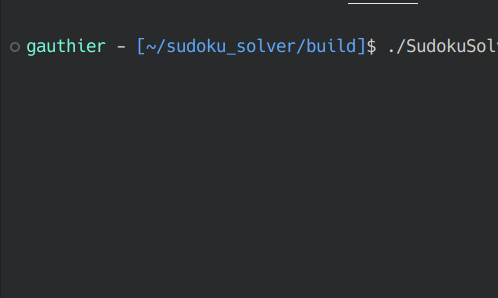

<h1 align="center">
  <br>
  
  <br>
  Sudoku Solver
  <br>
</h1>

<h5 align="center">A Sudoku solver, developped in C++ and compatible with Linux and Windows, displayed in CLI</h5>

# Concepts applied in this project
* CMake
* Backtracking algorithm
* Cross-platform compatibility and compilation
* Object-oriented programming in C++

# Usage
```bash
./SudokuSolver
```
(which reads automatically the `./test.txt` file)
or 
```bash
./SudokuSolver path-of-file
```

# Compilation
To get the `Makefile`, run: 
```bash
cmake .
```
(or `cmake chemin_vers_le_dossier` to compile from another folder)

Then:
```bash
make
```

will build the executable `SudokuSolver`.
